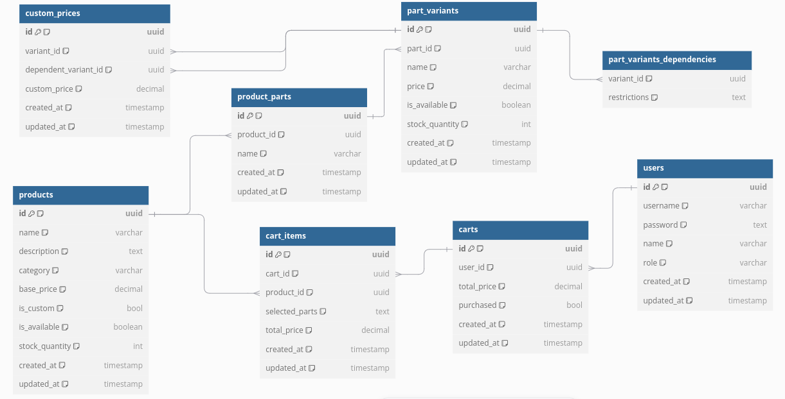
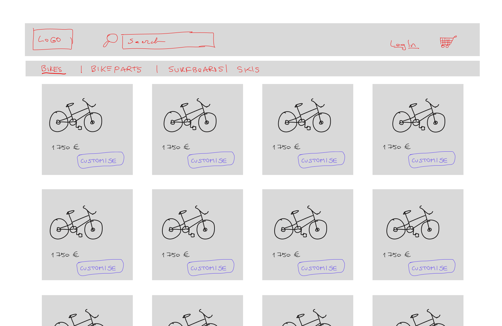
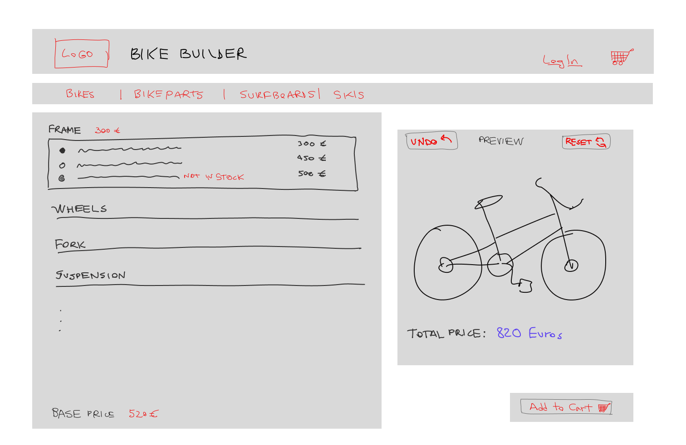
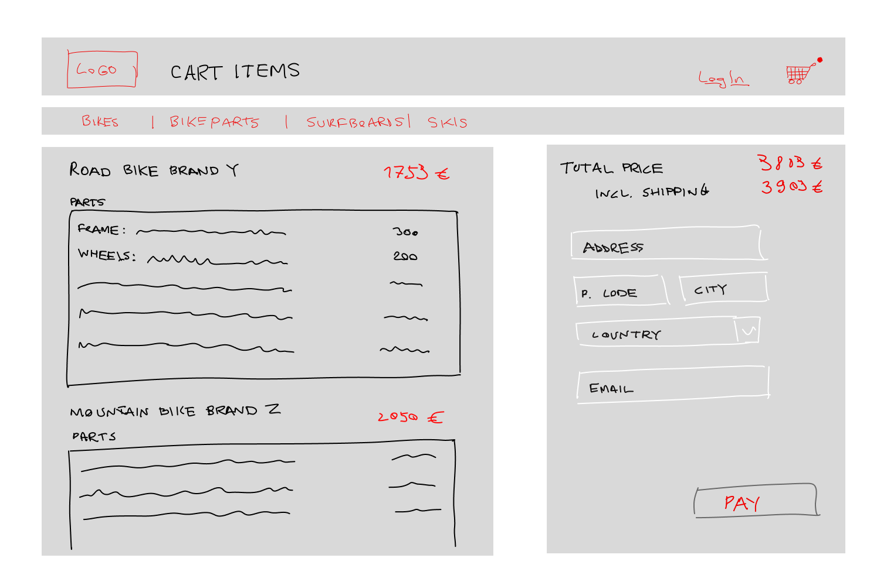
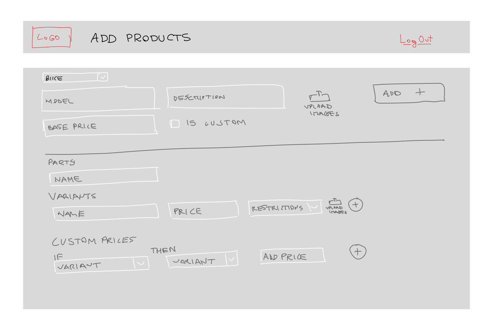
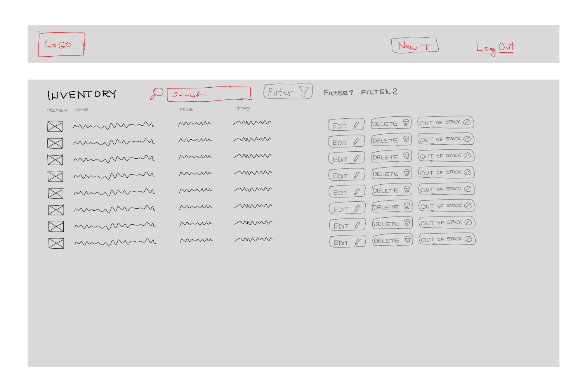

# Marcus Scott Bike Company Inc.


*Fig. 1 Bike shop logo*

In a real-life situation, this would be an iterative process. During the planning phase there would be a discussion with Marcus regarding the requirements, clarifications would be needed, new questions would arise. Things would have to be quite clear before starting to code. Understanding the requirements, what needs to be delivered and what is optional or extra within the agreed timeframe or estimation, is crucial.

Further in the process, before the handover, Marcus would see the progress and give feedback. Based on that changes and improvements would be made that are within the scope of the project.

Given that I am free to interpret any other specifications, I have made several assumptions.

## Assumptions

### Same customisation across all product categories?

One clarification needed would be if all the product categories (bicycles, sufboards, skis) allow some kind of customisation. I made the assumption that at least a few more categories besides bicycles could require customisation, but not all. So there should be an option to mark a product as custom or not.

### Will there be additional staff members?

Are there multiple admins managing the store, does it require different roles or permissions for different users? I have decided this is out of scope anyway, as I will not implement authentication in this first iteration. It would, of course, be a requirement in a real-life scenario.

### Are customers users? & Payments

Should customers be able to create accounts to see previous orders, or save their carts to be able to see them across multiple devices? Can they buy stuff as guests? If so, what data is required from them to make the purchase.

Regarding payment, is automated payment required and if so what payment methods are allowed: credit card, Paypal, etc? In that case I would choose something like Stripe payments (I like their APIs and documentation and it's quite intuitive to implement), which offers invoicing, refunds, webhooks for different actions, etc. What specific rules are there for tax, what what about shipping calculations based on distance. Will the platform require different currencies or localisation?

While those would be essential in a real-life situation, I will not implement them in this iteration. The only assumption would be that users can buy bikes as guests by adding their email, shipping address, etc.

Either way, email implementation would be required to send purchase confirmation and shipping confirmation, in which case I would implement jinja2 for creating templates for emails and something like aiosmtplib for an SMTP client.

### UI Preferences

Would the website require branding guidelines or what preferences does Marcus have for it, should the interface be optimised for mobile devices. I would assume so, nowadays it's something essential.

What happens to out of stock products/parts, should they still be shown but marked as out of stock, or be completely hidden. Should the number of items left in stock be shown next to the product/part? I choose to show the product, disabled and grayed out with a "Out of stock" text next to it.

Are there any existing assets I should use? It would be necessary to clarify if there are images for each variant/part and product separately. I assume images would be required somehow for this store and Marcus should be able to upload these assets through the admin interface or import them in bulk somehow. Initially I would create a file service to handle uploading images, leaving the option to use an AWS S3 bucket in the future and serve them through a CDN to decrease loading times, but initially just using the local storage (which is also cost effective for starters). Could still use Cloudflare as a CDN provider, would optimise the images, implement lazy loading in the frontend. Would probably help to generate previews or thumbnails in the backend and serve those to the frontend.
In this case I would assume all images would be public, so there would not be any view restrictions. For now, I have just added some mounted bikes images in the frontend directly to show a more realistic UI, given that I consider this out of scope. This is not however, how I would implement it in real-life, as it would require a developer to make updates and would end up being a nightmare to maintain. Would not scale.

### Inventory and stock

Should the inventory be updated in real-time or manually updated by Marcus? I have decided to combine the two options. Each time a product or part is purchased, it should be substracted from the total number of items in the inventory. Marcus can manually change that number through the admin interface and he can also temporarily mark a product/part as unavailable through a single button.
Does he need big bulk additions or updates? In that case some import/export functionality could be added, but it would increase the complexity.

### Conditional/Dynamic pricing

The **crux** 🏔️🧗of implementing this online shop is in the dependcies rules and conditional/dynamic pricing.

One question that would come up would be regarding how many different rules could be there, and is there a priority or order (what happens if there are multiple rules for a variant, which of the parts takes priority).

I came back and back again to the drawing board trying to figure out how to handle it. Of course there is only limited time to spend on this part.

- One option, temporarily, the simplest one would be to just hard-code the rules in the backend, would be pretty straightforward using a switch case directly in the application code or having a rules json file with all the conditions and price adjustments that can be used to parse and apply the rules. But where would the fun be in that? Besides... this will definitely require constant adjustments in the code by a developer and could end up messy, and would be very difficult to scale and maintain.
- Another option would be having a detailed rules table(s) instead of the json file, with the conditions, type of conditions, priorities, price adjustment, etc.. So these rules would be stored dynamically in the database and just like before they would be evaluated dynamically in the backend. This would be very flexible, Marcus could set up these rules, their priorities, etc. through the admin interface. It would definitely be more scalable than our previous options. Rules can be removed, added, or modified dynamically without the intervention of a developer. These rules could also be added for future product if these are customisable as well. Performance could be improved with some caching. But it might end up being to complex for Marcus and non-technical staff, they might need training to understand the dynamics of the rules. It also increases the development estimation, and due to possibly complex conditions might also increase the maintainability of the queries.
- I decided to simplify this a bit by having two tables, one for the dependencies of the parts and their restrictions. And another one for the price adjustments. For now I will not take into account priorities of these conditions. This still offers the flexibility of the previous option as well as scalability, as all this can be handled by Marcus and his staff, but allows for an easier admin interface. It will, of course, not be able to handle very complex conditions and might end up requiring more initial work from the admins to set it up. This could of course be simplified by maybe introducing a an import/export option to make updates in bulk and speed up the process. But this would increase the development time and complexity,
so would not be implemented in this iteration. It would require parsing and validating the imports, the import functionality would have to be very robust and reliable.

## Project structure

- Backend folder contains the api of the shop, using FastAPI Python framework, and SQLModel ORM library, Pytest for tests. It includes Open API docs with a Swagger UI.
- Frontend folder contains the UI of the shop, using VueJS, Vite, TailwindCSS, Axios, and Pinia.
- Infra folder contains the docker-compose file for local development, which includes a db (Postgres) service, the backend service and the frontend service.
- Also include Github workflows directory for BE and FE, for CI, which runs linters and tests.

## Breakdown of Tech Stack

Here’s a breakdown of the technologies I have used and why I chose them. One thing they all have in common besides the explanations that will follow is that they are the technologies I am more familiar with at the moment as I used them in my last project.

I will not be implementing caching in this iteration, but I would go for Redis, because I more familiar with it. Will also not implement Cache-Control headers in the API.
Will also not implement async, although I would definitely do it in a real life situation to be able to handle multiple requests concurrently. FastAPI is built on Starlette (an asynchronous web framework), so it can handle async easily. For database I would proabably use something like asyncpg, although I have found the handling of async in SQLALchemy to be a bit difficult to work with. As it doesn't make sense to just implement async for the routes without async db, because having syncrhonous database calls will reduce the benefits of async.
Will not implement background jobs, but this would be necessary for stuff like the emails, inventory updates, depending on how it's handled I would say prices calculations. Maybe I would use something like Celery, but I am not super familiar with it.
In the frontend, beside the lazy-loading for images, would be minification, Vite automatically minifies files during build. Pinia will help to reduce API calls.
Although not within the scope of this implementation, I could see using Websockets for real-time updates for stock changes or calculating the dynamic pricing.

### Database

I chose a relational database, PostgreSQL, which in my opinion helps with the well-defined relationships between our entities (bikes, parts, cart items, etc.). While I shortly explored the option of using MongoDB, as I am not super familiar with NoSQL databases, I assumed a relational database would help with the complex and dynamic pricing logic and keeping everything consistent, so I decided against it.

### Backend Technologies

#### FastAPI

It's nice for building quick RESTful APIs, can easily add logging and error handlers with a middleware. Offers great performance by using Uvicorn (an ASGI server). Offers async from the get go.

#### SQLModel

It's still pretty new and there is less documentation that what SQLAlchemy offers, but it combines SQLAlchemy (ORM library) and Pydantic (data validation) for readable models, type hints, validation, and serialisation. It integrates easily with FastAPI. I wouldn't really use this on production, given that it couples the DB schema with the DB schema too tightly (lacks separation of concerns) and it's just a wrapper, but it's okay for quick prototypes like this.
If there are trickier queries or bulk operations you can write raw SQL when needed.
You can easily add indexes for the tables.
It's database agnostic.
I used Alembic for database migrations.

#### Backend Testing

I used Pytest for writing tests in the backend. I like the simplicity and the documentation. It has async support. Pytest-mock as a mocking library.
FastAPI provides the built-in TestClient, which can simulate HTTP requests, so I can test the API endpoints.

### Docker and Docker Compose

Benefits of stuff working the same way everywhere. Speeds up deployment.

### Frontend Technologies

#### VueJS

Easy to pick up. Component-based just as React, easy to reuse components. Can debug or improve performance with Vue Devtools. It offers routing and other tools out of the box. I like the intuitive single-file component, with a template part for the HTML, a script part for the Javascript, and a style section for the CSS. It has a built-in reactivity system.

#### Pinia

While VueJS offers a state management tool already (Vuex) it is considered legacy currently, so I used Pinia. It is built for Vue 3, unlike Vuex which was adapted from Vue 2 to Vue 3. I find it very intuitive and simple to use. Works well with Typescript. I find it very manageable by having modular smaller stores.

#### Tailwind CSS

While I am still on the fence regarding Tailwind I used it because it makes styling really fast. But I dislike that it ends up making the HTML very messy/crowded. If not used propely it can end up creating extra work. I like the Tailwind config file where I can add "branding" customisation.
I personally find `@apply` a bit redundant.

#### Frontend Testing

Vue offers Vue Test Utils for testing Vue components and Jest as the testing framework.

#### Vite

Vue officially recommends Vite as a build tool and works out of the box with Vue 3.

## Tasks

I have split the project into smaller tasks, to have defined goals throughout the project and make sure everything that's necessary is delivered.

Ideally, customers should be able to search and filter for products or parts easily. And the admins should be able to search and filter items in their inventory for easy management. But this will not be implemented in this iteration.

I tried to prioritise the tasks, they are listed by priority as following:

### View and customise bikes

_As a customer, I want to view, buy, or customise bicycles so that I can select my desired options for parts from a list and see the total price of what I am about to purchase._

Backend:

- [x] Define a SQLModel schema for products, parts, and prices. Should differenciate if the product is customisable or not.
- [x] Implement APIs for retrieving products and their parts/variants.
- [x] Implement pagination for products.
- [x] Add tests and allow CORS for frontend.

Frontend:

- [x] Create the UI views for Product List And Bike Builder wizard in VueJS with Tailwind.
- [x] Implement state management with Pinia to track selected variants and current price.
- [x] Update pricing dynamically based on customer's selection.
- [x] Add tests

Logic:

- [x] Handle price calculation logic, excluding dependencies for now.

### Handle items not in stock

_As a customer, I want to know when a selected part is out of stock so that I can make other choices._

Backend:

- [x] Add fields to products and variants to track stock status and availability.
- [x] Expose this information in the API endpoints.
- [x] Add tests

Frontend:

- [x] Display unavailable or out of stock options as grayed-out and with an "Out of Stock" tag.
- [x] Add tests

Out of scope:

Updating the stock availability in real time.

### Add to cart

_As a customer, I want to add my custom bike selection to the cart so that I can either purchase it now or later._

Backend:

- [x] Define SQLModel models for the cart and cart items.
- [x] Implement an API and CRUD services to save the selected configuration to the cart.
- [x] Add tests

Frontend:

- [x] Add an "Add to Cart" button that saves the cart and cart items in the database and in the browser's localstorage. It should be able to handle adding multiple custom bikes to the cart.
- [x] Add a cart icon that changes when there are items in the cart.
- [x] Add tests
  
Out of scope:

Edit cart option will not be implemented yet.
A user will not be created and the cart will not be saved for a specific user, as of now.

Notes:

I am using localStorage as the first option here to reduce the api calls. So the cart will be save in the frontend, and in the backend as well at first. Then, if the customer comes back later, the cart will be fetched from localStorage. As we are not linking the cart to a user, if the localStorage data is deleted, the cart data will be lost for the customer.

### Define restricted combinations

_As the admin (Marcus), I want to define and manage rules for restricted combinations so that customers can only choose valid combinations._

Backend:

- [ ] Add a table to manage restricted combinations.
- [ ] Expose the restrictions in the API so frontend can enable or disable options when the customer makes choices.
- [ ] Add tests.

Frontend:

- [ ] Add the restrictions in the store.
- [ ] Prevent customers from selecting invalid options in the bike builder.
- [ ] Add tests.

### Define custom pricing rules

_As the admin (Marcus), I want to handle custom pricing for parts and combinations so that I can ensure accurate pricing and avoid losing money._

Backend:

- [ ] Create tables for custom prices and pricing dependencies. Custom price overrides the variant's price.
- [ ] Create API endpoints for retrieving and getting the new price calculation.
- [ ] Add tests.

Frontend:

- [ ] Add UI components and views for admins to manage custom pricing in the admin are.
- [ ] Update pricing in the bike builder view considering custom pricing dependencies.
- [ ] Add tests.

### Manage product catalog

_As the admin (Marcus), I want to manage the inventory (add, update, or delete products and parts) so that I can keep the inventory up to date._

Backend:

- [x] Add API endpoints for creating, updating (including availability, prices, and stock), and deleting products and parts.
- [x] Add tests

Frontend:

- [ ] Build a simple admin dashboard with forms for managing products and parts.
- [ ] Add tests

Out of scope:

Uploading images for products and parts/variants.

### View cart summary

_As a customer, I want to view a summary of my cart, including item details and the total price, so that I can confirm my purchase._

Backend:

- [ ] Implement an API endpoint to fetch cart details, including pricing breakdown.
- [ ] Add tests.

Frontend:

- [ ] Display cart in a cart summary view, check the localStorage first for the cart.
- [ ] Add a "Clear Cart" button to clear the cart items. This should update the cart icon too.
- [ ] Add tests.

Out of scope:

There will be no Edit Cart option implemented in here.
As we are not saving the cart for a user account, this will be fetched from localStorage instead.
The purchase of the cart will not be implemented. Optionally, at most, there would be a Buy button, that updates the stock/inventory and clear the cart in the frontend.

### Mark parts as out of stock

_As Marcus (the admin), I want to mark certain parts as "temporarily out of stock" and change the number of items they have in stock for products or parts so that they aren't available for selection by customers._

Backend:

- [x] Add API enpoints for marking parts in/out of stock and updating the number of items in stock.
- [x] Add tests.

Frontend:

- [ ] Add forms in the admin area for stock status updates.
- [ ] Add tests.

Out of scope:

This will not update the stock in real-time for customers, but it should reflect in the frontend when data is fetched after the stock updates.

### Manage categories

_As Marcus (the admin), I want to manage categories for products so that I can prepare for future business expansion (surfboards, skis, etc)._

Backend:

- [x] Add a category field in the products table.
- [x] Expose the field in the API for edit in the admin interface.
- [x] Add tests.

Frontend:

- [ ] Extend the admin dashboard to handle categories updates. The admin should either be able to type a new category or select from existing ones.
- [ ] Display the different categories in the products page for filtering.
- [ ] Add tests.

---

> Data model: What data model would best support this application? Can you describe it? Include table specifications (or documents if it's a non-relational database) with fields, their associations, and the meaning of each entity.

See choice for a relational database in the `Breakdown of Tech Stack` section in this document.

The data model should support product customisation (with different parts and options) as well as supporting future expansion into other sport-related products (ideally it should support customisation of more products than just bicyles, but it should not be forced). The data model should handle stock management and availability. It should also handle options restrictions based on user choices as well as custom and conditional pricing based on user choices.

My proposed data model includes several tables, for products, parts, variants, restrictions, custom pricing, cart and cart items. It is flexible and it allows adding new products and categories of products easily without modifying the current schema.


*Fig. 2 Bike Shop Database diagram*

You can also check out the database schema written in DBML [here](database.dbml) in more detail (it includes notes for the associations and entities), which was used to generate the diagram on [dbdiagram.io](https://dbdiagram.io/).

> Main user actions: Explain the main actions users would take on this e-commerce website in detail.

- Product Browsing: Users can view available products as well as individual parts (assuming they can buy individual parts as well). On this page, users should be able to search for products, filter by categories, order by price, etc. The customers would see cards with the items. The items that are not customisable they can directly add to the cart. Those which are customisable they will see a "Customise" Button which takes them to the Builder page.
- Customization/Builder: On this page, users select from available options for each part following a wizard-like feature. An accordion-like view, where you have to select the first option before moving on to the next sections. The available choices based on dependencies and stock status will be updated dynamically. They would see individual prices (prices update dynamically as well depending on dependencies) of the parts as well as the base price on one side. While on the other side, they will have a preview of the custom bike and thy see the total price. There will be a button to add it to the cart. They could also be able to undo their last choice or reset the customisation and start all over.
- Add to Cart: When the user is satisfied, they can add the custom product to their cart, which stores the selected options and the final price.
- Cart Summary: The user can leave the cart view at any time and navigate back to it by clicking the Cart icon. Here they can view the (possibly multiple) products and list of parts with their individual prices if their are custom. They can see the total price. And they can purchase their cart by adding their email, shipping details and can proceed to Payment by clicking a "Pay" Button.

See the following figures for a minimalistic visual representation of the main views/pages:


*Fig. 3 Products Browsing Page*

*Fig. 4 Bike Builder Page*

*Fig. 5 Checkout Page*

> Product page: This is a read operation, performed when displaying a product page for the customer to purchase. How would you present this UI? How would you calculate which options are available? How would you calculate the price depending on the customer's selections?

If it's not a customisable product, the product would be displayed to the user with the details or description, the price.

But if is customisable, then the user would have to go through different sections of each part where they can select from a list of variants for that part.

Based on the interactive selection of variants, I would use the restrictions data information for variants to deactivate the restricted variants. Would also have to check the stock availability from the fetched data to disable those variants.

Similarly, for calculating the price, would add the prices of the selected options on top of the base price, and check the custom pricing table to adjust the pricing for specific combinations.

> Add to cart action: Once the customer makes their selection, there should be an "add to cart" button. What happens when the customer clicks this button? What is persisted in the database?

When the user adds a customised product to the cart, this data of the cart items will be persisted to localStorage first then a POST request will be sent to the Backend to add a cart in the carts table and the items belonging to that cart in the cart_items table. This will included a list of the selected parts, and the total price.

Why saving to localStorage? It's not sensitive data. Can read first from there before making an extra API request. And currently, there is no user authentication for customers, so they cannot retrieve their cart from the database.

Why save to the database anyway? This is saved for future reference for Marcus, he should be able to get a notification of the new cart to prepare and ship the order. It can be used in future sales reports or an Analytics page as well.

> Administrative workflows: Describe the main workflows for Marcus to manage his store.

The admin interface would require authentication, and it could handle multiple users of course, as Marcus could have multiple different staff members under our previous assumption.

- Product Management Workflows: Marcus would need be able to add new products, such as bikes (in the future surfboards, skis, other sport items). As he offers customisation for products, Marcus can define parts and variants of parts optionally. Marcus should be able to set custom pricing based on customer choices.
- Inventory Management Workflows: Marcus can update/edit or delete existing products or parts and variants. Marcus can check the stock levels to know which new items to order for the shop, he can temporarily mark something as out of stock manually if needed, and could update the amount of items he has in the store. He can track the stock for each product or individual variant.
- Order Management Workflows: Marcus should get notifications of new orders and should be able to access the list of incoming orders and their details. Marcus should be able to confirm payment and prepare the order for shipping. He should be able to update the status of the order when completed or shipped and the customer should receive an email with the shipping/delivery details. Marcus could possibly be able to handle returns or refunds through the admin interface as well.
- Analytics: Marcus would probably want to generate sales reports for specific time periods and check which products perform the best or the worst.

See the following figures for a minimalistic visual representation of the main views/pages:


*Fig. 6 Add New Products and Variants Page*

*Fig. 7 Edit Inventory Page*

I consider Order Management and Analytics out of scope for this iteration.

> New product creation: What information is required to create a new product? How does the database change?

Product details that are required: name, description, base price, category, and if it's custom or not.
If the product is customisable, then associated parts and their variants are required too, for users to be able to actually build their bikes.

Entries are added to products, product_parts, and part_variants tables. In that order, so the ids can be used as foreign keys to establish the relationship between all the entities.

> Adding a new part choice: How can Marcus introduce a new rim color? Describe the UI and how the database changes.

Marcus could go to the inventory page and add a new variant or part and its variants by clicking on a "Add <>" Button. A simpler view of the New Product page could be displayed for adding the new choice. It would have the option to add multiple new choices for the same part on the page, and establish any new restrictions as well as new custom prices.

If the part doesn't exist, it will create a new entry in the product_parts table and use that id, otherwise it could use the existing id of the part to create an entry in the parts_variants table, followed optionally by adding new entries in the part_variants_dependencies and custom_prices tables, for new dependencies or custom prices respectively.

> Setting prices: How can Marcus change the price of a specific part or specify particular pricing for combinations of choices? How does the UI and database handle this?

Marcus can set the default prices of pricing for combinations of choices while adding the product. Alternatively, Marcus can use the inventory page once again to filter for the specific part in the list and click on Edit, which will redirect him to a page where he can edit the pricing. Ideally he could be able to do it directly in the inventory by expanding the part in the list and including the editable fields in there.

There will be an update query for the price field to the database in the part_variants table or entry(ies) will be added/modified in the custom_prices table.

## Development setup

To run the app locally for development make sure to install docker and docker compose, then:

``` sh
cd infra
docker compose up --build
```

Docker and Docker compose versions used:

- Docker version 27.3.1
- Docker Compose version v2.19.1

You can access the frontend at [http://localhost:5173](http://localhost:5173)

Backend/API URL running on uvicorn: [http://localhost:8000](http://localhost:8000)

API docs (Swagger) here: [http://localhost:8000/docs](http://localhost:8000/docs)

The docker compose file for development includes a PostgreSQL service. You can check the docker-compose.yml [here](infra/docker-compose.yml).

### Seed

You can seed the database with:

``` sh
docker exec bikeshop_be_fastapi  python db_seed.py
```

### Running Tests

Run the backend tests with (Pytest):

``` sh
docker exec bikeshop_be_fastapi pytest
```

Run the frontend tests with:

``` sh
docker exec bikeshop_fe_vue npm run test
```

Alternatively, check `backend/README.md` or `frontend/README.md` on how to do it without Docker.

## Check out the live version

I have used the free options on render.com to deploy this app. There are 3 services: a postgres db, a frontend service, and a backend service. Environment variable were used for configuration. As it's for free, render shuts down servers after 15 minutes (this happens with the API service), so it might take some time until the services start on the first request. It could be more than a minute.

Live frontend: [https://bike-shop-fe.onrender.com](https://bike-shop-fe.onrender.com)
Live API: [https://bike-shop-api-vzjl.onrender.com](https://bike-shop-api-vzjl.onrender.com) (Swagger is turned off)

You can check if the API is live by going to [https://bike-shop-api-vzjl.onrender.com/api/v1/healthcheck](https://bike-shop-api-vzjl.onrender.com/api/v1/healthcheck).
